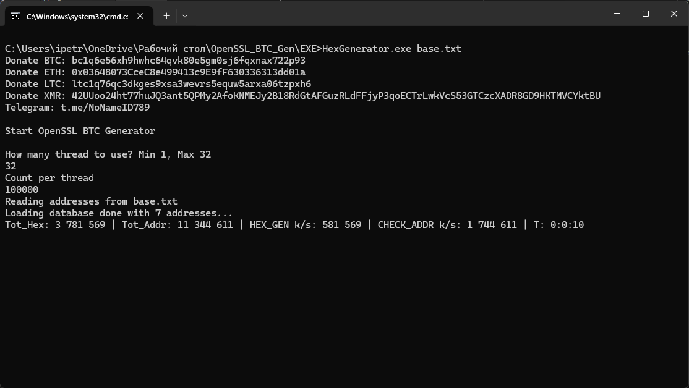

# OpenSSL_BTC_Gen
Данный чекер использует генератор случайных чисел OpenSSL-0.9.8h

ПО находится в папке **EXE**

Идея взята [thc-btc-rng-bruteforce](https://github.com/hackerschoice/thc-btc-rng-bruteforce)

На вход программы подается база адресов, можно любых. Но отберутся адреса 1u, 1c (P2PKH) и 3 (P2SH).
Если что то найдется, будет адрес в формате hash160 и приватный ключ в выходном файле _FIND.txt_
## Как запустить?
Для запуска надо подготовить базу с названием _base.txt_ и положить в корень _EXE_. Далее два раза кликаете RUN.BAT.
ПО спросить 2 вороса:

How many thread to use? Min 1, Max N (Сколько процессоров использовать?) - выбирате количество потоков

Count per thread (Количество на поток) - рекомендую указать 100 000.

Если программа не запускается, нужно установить дополнительно [.NET 8.0 Runtime x64](https://dotnet.microsoft.com/en-us/download/dotnet/thank-you/runtime-8.0.10-windows-x64-installer)

